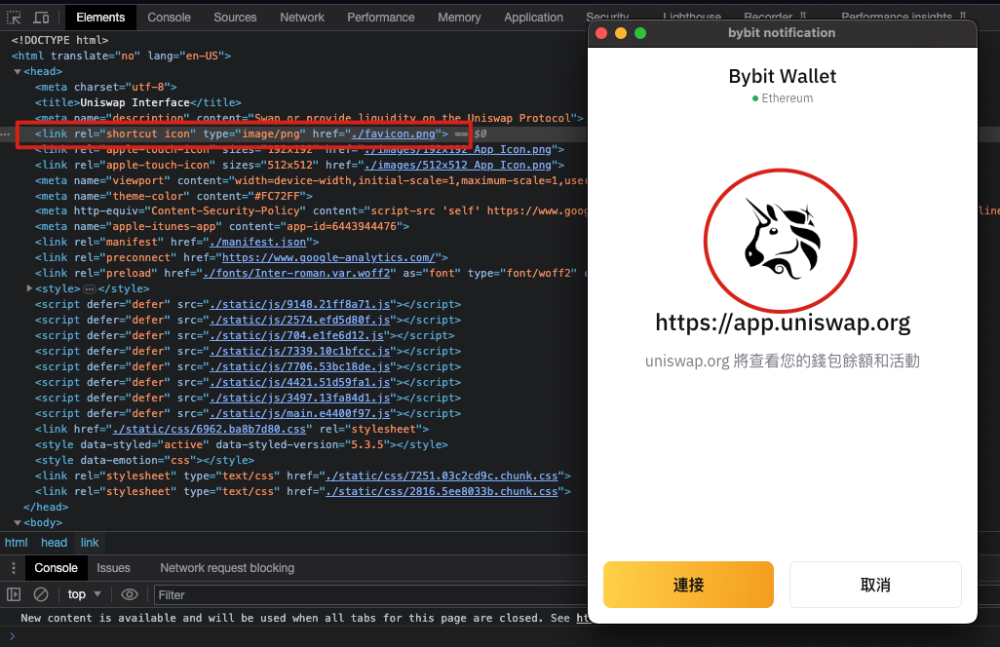
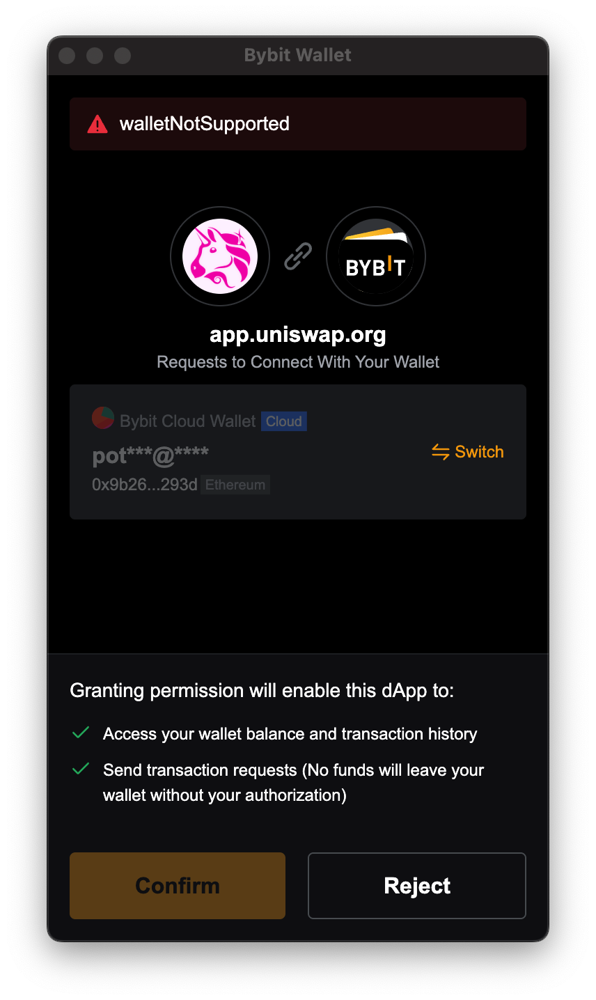
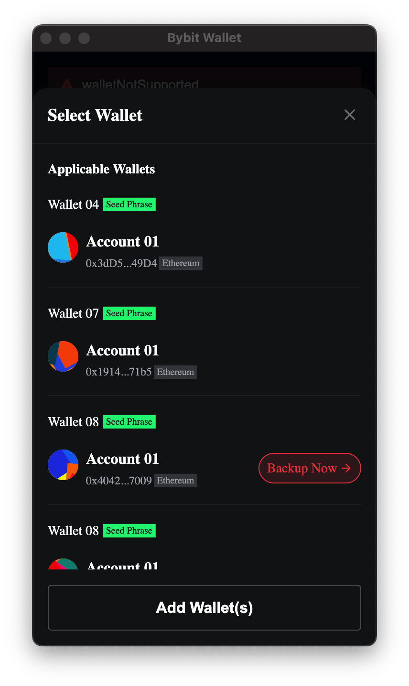

# EVM Integration Guide

## Supported Chains

| Chain Name      | Chain ID | Status |
| ----------- | ----------- | ----------- |
| Ethereum      | 1       | ✅ |
| MANTLE   | 5000        | ✅ |
| BNB Chain   | 56        | ✅ |
| Polygon   | 137        | ✅ |
| Optimism   | 10        | ✅ |
| Avalanche C   | 43114        | ✅ |
| Arbitrum One   | 42161        | ✅ |
| Fantom   | 250        | ✅ |
| zkSync Era   | 324        | ✅ |
| Linea   | 59144        | ✅ |
| Base   | 8453        | ✅ |
| Manta Pacific   | 169        | ✅ |
| ZetaChain   | 7000        | ✅ |
| MERLIN   | 4200        | ✅ |
| Blast   |   81457      | ✅ |

### Mnemonic/Private Key Wallet

| Chain Name      | Chain ID | Status |
| ----------- | ----------- | ----------- |
| Ethereum      | 1       | ✅ |
| MANTLE   | 5000        | ✅ |
| BNB Chain   | 56        | ✅ |
| Polygon   | 137        | ✅ |
| Optimism   | 10        | ✅ |
| Avalanche C   | 43114        | ✅ |
| Arbitrum One   | 42161        | ✅ |
| Fantom   | 250        | ✅ |
| zkSync Era   | 324        | ✅ |
| ZetaChain   | 7000        | ✅ |
| OKX Chain | 66        | ✅ |
| MERLIN   | 7000        | ✅ |
| BEvmChain   |   11501      | ✅ |
| Manta Pacific   | 169        | ✅ |
| Linea   | 59144        | ✅ |
| Blast   |   81457      | ✅ |
| Base   |   8453      | ✅ |
| BounceBit   |   6001      | ✅ |
| B Square   |   223      | ✅ |
| Cronos   |   25      | ✅ |
| GM Network   |   2777      | ✅ |
| Bitlayer   |   200901      | ✅ |
| Taiko   |   167000      | ✅ |
| Scroll   |   534352      | ✅ |


## Integrating Bybit Wallet

For dapps compatible with Metamask, the provider is called using `window.ethereum`. To integrate with the Bybit Wallet plugin, simply replace `window.ethereum` with `window.bybitWallet`.

## Offline Signing Methods and Supported Types

| Type      | Supported |  Remarks  |
| ----------- | ----------- | ----------- |
| eth_sign | ❌ | Not supported due to security risks |
| personal_sign | ✅ | |
| eth_signTypedData | ❌ | Not supported due to security risks |
| eth_signTypedData_v3 | ❌ | Not supported due to security risks |
| eth_signTypedData_v4 | ✅ | |

## EIP6963

Bybit Wallet supports EIP6963, which is a proposal to address the issue of multiple wallets sharing `window.ethereum`. For more details, please refer to [EIP6963](https://eips.ethereum.org/EIPS/eip-6963).
We encourage developers to prioritize the use of EIP6963 to ensure compatibility with more wallets.
To integrate with Bybit Wallet in your Dapp, simply add the following code:

```js
const providers: EIP6963ProviderDetail[];

function onPageLoad() {

  window.addEventListener(
    "eip6963:announceProvider",
    (event: EIP6963AnnounceProviderEvent) => {
      providers.push(event.detail);
    }
  );

  window.dispatchEvent(new Event("eip6963:requestProvider"));
}
```
For more details, please refer to [EIP6963](https://eips.ethereum.org/EIPS/eip-6963).

## API Reference

## Checking if Bybit Wallet is Installed and Running
After installing and running the Bybit Wallet, you can see a window.bybitWallet object in the developer console of a new browser page. This is how your website interacts with the Bybit Wallet.
Web3 Browser Detection
To check if the Bybit Wallet is installed and running in the browser, copy and paste the following code snippet into the developer console of your browser.

First, we need to check if Bybit Wallet is installed and running.
    
```js
if (typeof window.bybitWallet !== 'undefined') {
  console.log('bybitWallet is installed!');
}
```

## Defining the DApp Icon

When your website sends a login request to Bybit Wallet users, Bybit Wallet may generate a modal window that displays the icon of your website.



We will use the HTML selector `<head> link[rel="shortcut icon"]` to retrieve this icon. When defining the icon, you need to follow the Favicon standard and ensure that your website's head contains a link tag, similar to `rel="shortcut icon"`.

```html
<head><link rel="shortcut icon" href="https://your-site.com/your-icon.png" /></head>
```

## User Status

Currently, when interacting with this API, you need to consider the following two questions:

- What is the current network?
- What is the current account?

Both of these can be obtained synchronously using `window.bybitWallet.chainId` and `window.bybitWallet.selectedAddress`.

You can also use events to listen for changes:

```js
// Account Change
window.bybitWallet.on('accountsChanged', (accounts) => {
    if (accounts.length) {
        console.log('Account Change:', accounts[0])
    } else {
        console.log('Account disconnected')
    }
});

// 网络变化
window.bybitWallet.on('networkChanged', (chainId) => {
        console.log('networkChanged, chainId：', chainId)
});
```

## Switching Chains

Bybit Wallet supports users to switch between different chains, such as switching from Ethereum to BSC. You can switch chains by calling the `window.bybitWallet.request` method:

```js
window.ethereum.request({
    method: 'wallet_switchEthereumChain',
    params: [{
      chainId: '0x1',
    }]
})
```

This method requests the user to provide a chainId for identification. The return value is a Promise that resolves to a single chainId string array. If the user rejects the request, the Promise will be rejected and return a 4001 error.
This request will trigger a popup window in Bybit Wallet. You should only request the account when responding to user actions, such as when a user clicks a button. While the request is still pending, you should always disable the button that triggers the request.
If you are unable to retrieve the user's account, you should first prompt the user to initiate an account request instead of a chain switching operation.

## Adding a New Chain

Unfortunately, Bybit Wallet, as a hosted wallet, does not currently support users adding other EVM chains. Only built-in public chains can be used at the moment.

## Adding Tokens

Bybit Wallet does not currently support users adding tokens via the window.bybitWallet API. If you need to add custom ERC20 tokens, you can do so manually through the wallet's UI interface.

<p>


</p>

## Sending Transactions

A transaction is a formal action on the blockchain, and in Bybit Wallet, it must be initiated by calling the `eth_sendTransaction` method. Transactions can involve simple Ethereum transfers, sending tokens, creating a new smart contract, or changing the state on the blockchain in any way. These transactions must be signed by an external account or initiated with a simple key pair.

In Bybit Wallet, sending a transaction using the `window.bybitWallet.request` method will compose an object similar to the following example:

```js
const transactionParameters = {
  gasPrice: '0x09184e72a000', // customizable by user during confirmation.
  gas: '0x2710', // customizable by user during confirmation.
  to: '0x0000000000000000000000000000000000000000', // Required except during contract publications.
  from: bybitWallet.selectedAddress, // must match user's active address.
  value: '0x00', // Only required to send ether to the recipient from the initiating external account.
  data:
    '0x7f7465737432000000000000000000000000000000000000000000000000000000600057', // Optional, but used for defining smart contract creation and interaction.
  chainId: '0x3', // Used to prevent transaction reuse across blockchains. Auto-filled.
};

// txHash is a hex string
// As with any RPC call, it may throw an error
const txHash = await bybitWallet.request({
  method: 'eth_sendTransaction',
  params: [transactionParameters],
});
```

### Parameters
- Gas Price `Optional`

Optional parameter - recommended for private chains.
In Ethereum, each transaction consumes a specified amount of Gas, which has a designated price. When block producers create the next block, they prioritize transactions with higher Gas prices in order to maximize profits. This means that a higher Gas price usually results in faster transaction processing, but at the cost of higher transaction fees. Please note that this parameter may not apply to L2 networks and BSC, FTM networks, as L2 networks may have a constant Gas price or even no Gas price.
In summary, while you can ignore this parameter on Bybit Wallet's default network, your application may have a better understanding of the parameter settings of the target network. In our default network, Bybit Wallet allows users to choose "Slow", "Medium", and "Fast" options when packing transactions, with increasing Gas premiums.

- Gas Limit `Optional`

Optional parameter and less commonly used by DApp developers. Gas Limit is an optional parameter, and we will automatically calculate a reasonable Gas price. You should be able to determine whether the deployed smart contract has benefited from this custom parameter for some reason.

- To `Optional`

A hexadecimal encoded Ethereum address. This parameter is required when transacting with a recipient (for all transactions except contract creation). When there is no "to" value but there is a "data" value, a new contract will be created.

- Value `Optional`

The hexadecimal encoded value of the network's native currency to be sent. In the main Ethereum network, this is Ether. This value is priced in wei, which is 1e-18 ether. Developers can use the Ethereum Unit Converter to understand unit conversions.
Please note that these numbers commonly used in Ethereum have much higher precision than local JavaScript numbers. Failure to account for this in advance may result in unexpected situations. For this reason, we strongly recommend using bn.js when dealing with numerical values for the blockchain.

- Data `Optional`

This parameter is required when creating a smart contract or interacting with a smart contract.
This value is also used to specify contract methods and their parameters. You can learn more about the encoding of this data in the Solidity ABI spec.

- Return Value

DATA, 32 bytes - the transaction hash, or zero hash if the transaction is not yet available.
When you create a contract, after the transaction is mined, use eth_getTransactionReceipt to obtain the contract address.

## Signature Information

- eth_sign Transaction Signing

```
 window.bybitWallet.request({
     method: 'eth_sign',
     params: [account[0], "0xdeadbeaf"],
 })
     .then((res) => console.log(res))
     .catch((error) => console.error);
```

The sign method calculates a specific Ethereum signature: sign(keccak256("\x19Ethereum Signed Message:\n" + len(message) + message))).
By adding a prefix to the message, the calculated signature can be recognized as a specific Ethereum signature. This prevents malicious decentralized applications from signing arbitrary data (such as transactions) and abusing the signature to impersonate the victim.

- personal_sign Message Signing

```
const signedData = await window.bybitWallet.request({
    method: "personal_sign",
    params: [
      'message to sign.',
      //await ethereum?.request({method: "eth_requestAccounts"})[0]
      account,
    ],
 });
```

In Ethereum, signing doesn't only happen when sending transactions.
Sometimes, a website may need to verify if we are the owner of a certain account. In that case, it will provide a message for us to sign in order to confirm our identity. This use case commonly uses personal_sign.

- eth_signTypedData Structured Data Signing (EIP-712)

```js
let domain = [
    {name: "name", type: "string" },
    {name: "version", type: "string"},
    {name: "chainId", type: "uint256"},
    {name: "verifyingContract", type: "address"}
]
 
let domainData = {
    name: "Gold",
    version: "1",
    chainId: ethereum.chainId,
    verifyingContract: "0x959922bE3CAee4b8Cd9a407cc3ac1C251C2007B1"
}

let permit = [
    {"name": 'owner', "type": 'address'},
    {"name": 'spender', "type": 'address'},
    {"name": 'value', "type": 'uint256'},
    {"name": 'nonce', "type": 'uint256'},
    {"name": 'deadline', "type": 'uint256'},
]
 
let message = {
    owner: '0xf39Fd6e51aad88F6F4ce6aB8827279cffFb92266',
    spender: '0x70997970C51812dc3A010C7d01b50e0d17dc79C8',
    value: 1000,
    nonce: 0,
    deadline: 100
}
 
let eip712TypedData = {
    types: {
        EIP712Domain: domain,
        Permit: permit
    },
    domain: domainData,
    primaryType: "Permit",
    message: message
}

let data = JSON.stringify(eip712TypedData)

window.bybitWallet.request({
    method:"eth_signTypedData_v4",
    params: [ethereum.selectedAddress, data]
 })
    .then(console.log)
```

Each project can have its own custom signature. However, this is only suitable for simple cases where the content of the signed message is irrelevant, such as verifying the account owner. But if it involves the transfer of tokens or NFT assets, caution is needed. If not designed properly, it can be easily exploited by attackers. Therefore, the standardized structured signature standard EIP-712 was developed.

## Switching Wallet Type

Bybit Wallet supports two types of wallets: hosted wallet and mnemonic/private key wallet. You can switch the wallet type by calling the following method:

```js
window.bybitWallet.request({
    method: 'switchWallet',
    params: [{
      walletType: [4, 5], // Enum values: [1, 4, 5], 1: Hosted Wallet, 4: Private Key Wallet, 5: Mnemonic Wallet
      chainType: 1 // Chain type, 1: EVM Chain, 2: SUI, 3: Solana, 4: BTC, 5: Stacks 
    }]
})
```

This method requests the user to provide an array of `walletType` and `chainType` to switch the wallet type. After initiating the request, a Bybit Wallet popup will appear as shown in the image below:


If the user's current wallet does not meet the switching conditions, the relevant components will be grayed out, and the user needs to click the switch button to change the wallet type.


Once the correct wallet is selected and confirmed, the Bybit Wallet will return the wallet address to the DApp.
