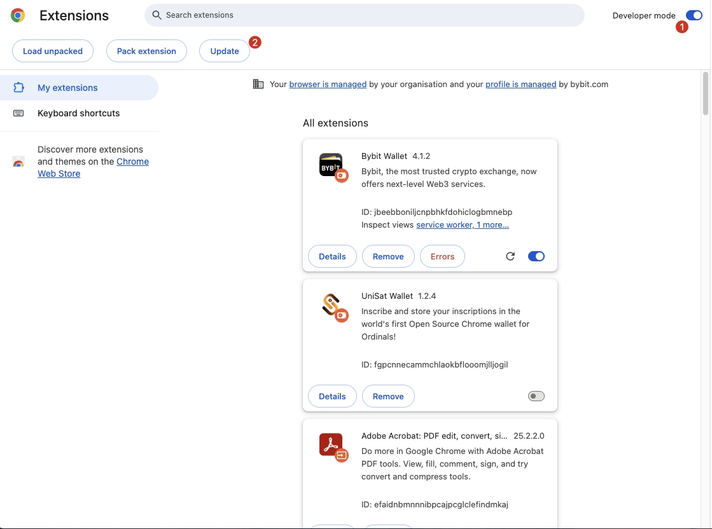

# How to Update the Plugin Wallet?

The update of the Bybit Wallet plugin is automatic, and the Chrome/Edge browser will periodically check for updates of installed plugins. Specifically, the update mechanism is as follows:

## Automatic Update

Chrome will periodically check for plugin updates in the background, usually every few hours. Updates will be automatically downloaded and installed.

## Version Control

Each plugin has a version number, and developers will update this version number when releasing a new version. Chrome will determine whether an update is needed based on this version number.

## Manual Update:

### Method 1: Actively Open the Plugin Homepage (Recommended)

Every time you open the Bybit Wallet plugin homepage, it will check for updates.

If an update is available, it will be automatically downloaded and installed.

Once the new version is installed, the plugin will automatically restart. At this point, the plugin window will automatically close, and you will need to refresh the Dapp page you have opened to continue interacting with the wallet.
### Method 2: Update from the Chrome Plugin Management Page
Users can manually update the plugin as follows:
- Open the Chrome browser, enter `chrome://extensions/` to access the extensions page.
- Enable "Developer mode" in the upper right corner of the page.
- Click the "Update" button, and Chrome will immediately check for updates of all installed plugins and install them.

If you need to manually update a specific plugin, you can follow the above steps.