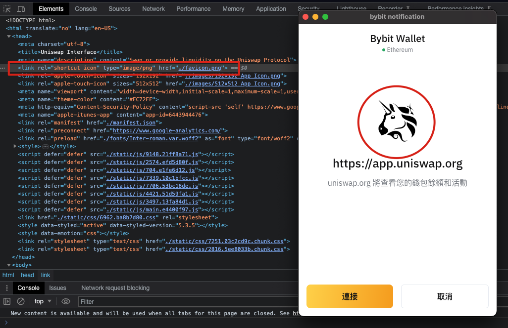
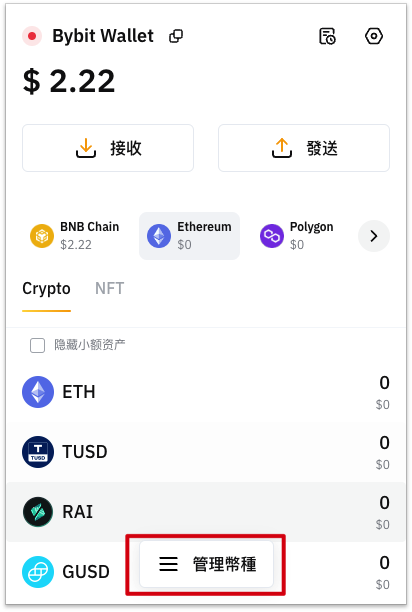
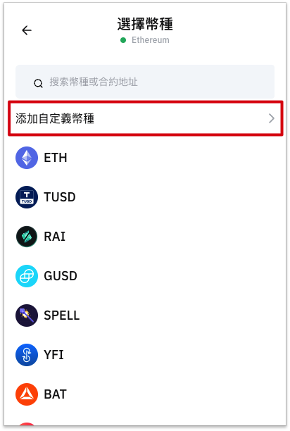
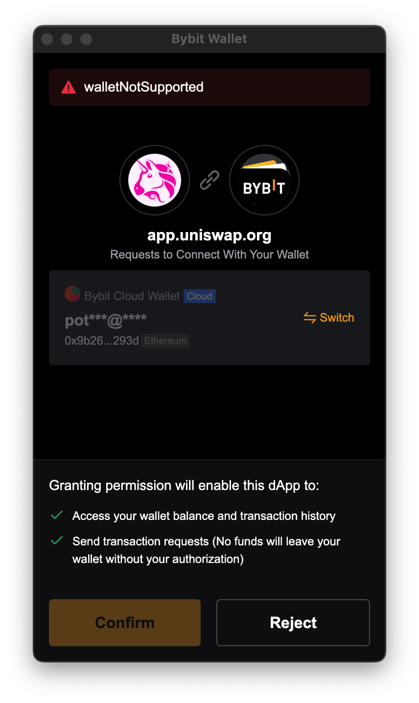
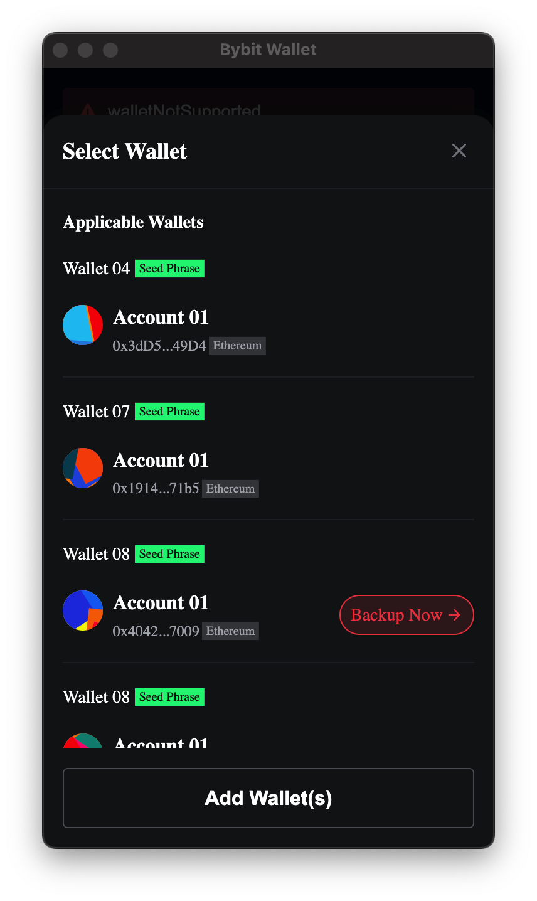

# EVM链接入指南

## 支持的链

### 托管钱包

| 链名称      | Chain ID | 状态 |
| ----------- | ----------- | ----------- |
| Ethereum      | 1       | ✅ |
| MANTLE   | 5000        | ✅ |
| BNB Chain   | 56        | ✅ |
| Polygon   | 137        | ✅ |
| Optimism   | 10        | ✅ |
| Avalanche C   | 43114        | ✅ |
| Arbitrum One   | 42161        | ✅ |
| Fantom   | 250        | ✅ |
| zkSync Era   | 324        | ✅ |
| Linea   | 59144        | ✅ |
| Base   | 8453        | ✅ |
| Manta Pacific   | 169        | ✅ |
| ZetaChain   | 7000        | ✅ |
| MERLIN   | 4200        | ✅ |
| Blast   |   81457      | ✅ |

### 助记词/私钥钱包

| 链名称      | Chain ID | 状态 |
| ----------- | ----------- | ----------- |
| Ethereum      | 1       | ✅ |
| MANTLE   | 5000        | ✅ |
| BNB Chain   | 56        | ✅ |
| Polygon   | 137        | ✅ |
| Optimism   | 10        | ✅ |
| Avalanche C   | 43114        | ✅ |
| Arbitrum One   | 42161        | ✅ |
| Fantom   | 250        | ✅ |
| zkSync Era   | 324        | ✅ |
| ZetaChain   | 7000        | ✅ |
| OKX Chain | 66        | ✅ |
| MERLIN   | 7000        | ✅ |
| BEvmChain   |   11501      | ✅ |
| Manta Pacific   | 169        | ✅ |
| Linea   | 59144        | ✅ |
| Blast   |   81457      | ✅ |
| Base   |   8453      | ✅ |
| BounceBit   |   6001      | ✅ |
| B Square   |   223      | ✅ |
| Cronos   |   25      | ✅ |
| GM Network   |   2777      | ✅ |
| Bitlayer   |   200901      | ✅ |
| Taiko   |   167000      | ✅ |
| Scroll   |   534352      | ✅ |

## 集成Bybit Wallet

兼容过 Metamask 的 dapp，provider 都是调用 window.ethereum。对接 Bybit Wallet 插件钱包，直接把 window.ethereum 换成 window.bybitWallet 即可。

## 离线签名方法及支持的类型

| 类型      | 是否支持 |  备注  |
| ----------- | ----------- | ----------- |
| eth_sign | ❌ | 因存在安全风险，当前不支持 |
| personal_sign | ✅ | |
| eth_signTypedData | ❌ | 因存在安全风险，当前不支持 |
| eth_signTypedData_v3 | ❌ | 因存在安全风险，当前不支持 |
| eth_signTypedData_v4 | ✅ | |

## EIP6963

Bybit Wallet 支持 EIP6963，EIP6963是一个解决多个钱包的共用`window.ethereum`的问题的提案，详情请参考[EIP6963](https://eips.ethereum.org/EIPS/eip-6963)。
我们鼓励开发者优先适用EIP6963，以便于您的Dapp能够兼容更多的钱包。
Dapp中只需要加入以下代码即可：

```js
const providers: EIP6963ProviderDetail[];

function onPageLoad() {

  window.addEventListener(
    "eip6963:announceProvider",
    (event: EIP6963AnnounceProviderEvent) => {
      providers.push(event.detail);
    }
  );

  window.dispatchEvent(new Event("eip6963:requestProvider"));
}
```
更多的使用方法请参考[EIP6963](https://eips.ethereum.org/EIPS/eip-6963)。


## API 参考

## 检测Bybit Wallet是否已安装并正常运行
在安装并运行 Bybit 钱包后，在浏览器新页面的开发者控制台中可以看到一个 window.bybitWallet 对象。这就是您的网站与 Bybit 钱包的互动方式。
web3 浏览器检测
要检测浏览器里是否安装了 Bybit 钱包并且正在运行，请复制并粘贴以下代码片段到您的浏览器的开发者控制台。

首先，我们需要检测Bybit Wallet是否已安装并正常运行。
    
```js
if (typeof window.bybitWallet !== 'undefined') {
  console.log('bybitWallet is installed!');
}
```

## 定义DApp的图标

当您的网站向 Bybit Wallet 用户发出登录请求时，Bybit Wallet可能会生成一个模态窗口，这个窗口上会显示您网站的图标。



我们会使用 HTML 选择器 `<head> link[rel="shortcut icon"]` 来获取这个图标。在定义图标时，您需要遵循 Favicon 标准，并确保网站的 head 里有一个 link 标签，类似 `rel="shortcut icon"` 这样。

```html
<head><link rel="shortcut icon" href="https://your-site.com/your-icon.png" /></head>
```

## 用户状态

目前，在与这个API交互时，需要考虑到以下两个问题：

- 当前的网络是什么？
- 当前的账户是什么？

这两点都可以通过 window.bybitWallet.chainId 和 window.bybitWallet.selectedAddress 同步获得。 

您也可以使用事件来监听变化:

```js
// 账户变化
window.bybitWallet.on('accountsChanged', (accounts) => {
    if (accounts.length) {
        console.log('账户切换：', accounts[0])
    } else {
        console.log('账户断开连接')
    }
});

// 网络变化
window.bybitWallet.on('networkChanged', (chainId) => {
        console.log('网络切换，chainId：', chainId)
});
```

## 切链

Bybit Wallet支持用户在不同的链之间切换，比如从以太坊切换到BSC。您可以通过调用window.bybitWallet.request方法来切换链：

```js
window.ethereum.request({
    method: 'wallet_switchEthereumChain',
    params: [{
      chainId: '0x1',
    }]
})
```

此方法请求用户提供一个chainId来识别。返回值为一个解析为单个chainId字符串数组的 Promise。如果用户拒绝该请求，Promise 将被拒绝并返回 4001 错误。
该请求会导致一个Bybit Wallet的弹窗出现。您应该只在响应用户操作时请求账户，比如一个用户在单击按钮的时候。在请求仍处于待处理状态时，您应该始终禁用导致请求被触发的按钮。
如果您无法检索用户的账户，您应该先让用户发起账户请求，而不是切链操作。

## 添加新链

Bybit Wallet暂时还不支持用户添加其他EVM链，目前只能使用内建的公链。

## 添加代币

Bybit Wallet暂时还不支持用户通过window.bybitWallet的API添加代币，如果需要添加自定义的ERC20代币，可以自己到钱包的UI界面中自行添加。

<p>


</p>

## 发送交易

交易是区块链上的一个正式动作，在Bybit Wallet中必须通过调用 eth_sendTransaction 方法来发起交易。交易可以涉及到简单的以太坊的发送，并可能会发送代币，创建一个新的智能合约，或以任何方式改变区块链上的状态。这些交易一定是由一个来自 外部账户 的签名，或一个简单的密钥对进行发起的。

在bybit钱包中，通过使用 window.bybitWallet.request 方法来发送一个交易将会组成一个类似以下案例的对象：

```js
const transactionParameters = {
  gasPrice: '0x09184e72a000', // customizable by user during confirmation.
  gas: '0x2710', // customizable by user during confirmation.
  to: '0x0000000000000000000000000000000000000000', // Required except during contract publications.
  from: bybitWallet.selectedAddress, // must match user's active address.
  value: '0x00', // Only required to send ether to the recipient from the initiating external account.
  data:
    '0x7f7465737432000000000000000000000000000000000000000000000000000000600057', // Optional, but used for defining smart contract creation and interaction.
  chainId: '0x3', // Used to prevent transaction reuse across blockchains. Auto-filled.
};

// txHash is a hex string
// As with any RPC call, it may throw an error
const txHash = await bybitWallet.request({
  method: 'eth_sendTransaction',
  params: [transactionParameters],
});
```

### 参数
- Gas Price `可选`

可选参数 – 建议在私链上使用。
在以太坊中，每笔交易所消耗的 Gas 都会有一个指定的价格。区块生产者在创建下一个区块时，为了达到利润最大化，会优先处理 Gas 价格较高的交易。这意味着，一个较高的 Gas 价格通常会让您的交易被更快地处理，但代价则是更高的交易费用。请注意，此参数可能不适用于 L2 网络和BSC，FTM网络，因为 L2 网络可能有一个恒定的 Gas 价格，甚至不存在 Gas 价格。
总而言之，虽然您可以在Bybit钱包的默认网络上忽略这个参数，但是您的应用程序可能会比我们更了解目标网络的参数设定。在我们的默认网络中，Bybit钱包允许用户在打包交易的时候进行"慢"、"中"和"快"的选择，相对应越来越高的 Gas 溢价。

- Gas Limit `可选`
  
可选参数，并且为 DApp 开发者较少用到的参数。 Gas 限制是一个可选参数，我们会自动计算出一个合理的 Gas 价格。您应该能了解到所部署的智能合约是否曾因某些原因而受益于该自定义参数。

- To `可选`

一个十六进制编码的 Ethereum 地址。与收件人进行交易时所需提供的参数（除合约创建外的所有交易。 当没有 to 值，但有 data 值时，新合约就会被创建。

- Value `可选`

要发送的网络本地货币的十六进制编码值。在主 Ethereum 网络中，即 Ether。此值以_wei_计价，即 1e-18ether，开发者可以借助Ethereum Unit Converter来理解单位转换。
请注意，这些在以太坊中经常使用的数字比本地 JavaScript 数字的精度要高得多。如果没有提前判定，可能会导致未知的情况。出于这个原因，我们强烈建议您在操作用于区块链的数值时使用bn.js。

- Data `可选`
  
创建智能合约或与智能合约进行交互时需要此参数。
这个数值也用于指定合约方法和它们的参数。您可在 the solidity ABI spec上了解更多关于该数据的编码方式。

- 返回值
  
DATA，32 字节 - 交易哈希，如果交易尚不可用，则为零哈希。
当你创建合约时，交易被挖掘后，使用 eth_getTransactionReceipt 获取合约地址。

## 签名信息

- eth_sign 交易签名

```
 window.bybitWallet.request({
     method: 'eth_sign',
     params: [account[0], "0xdeadbeaf"],
 })
     .then((res) => console.log(res))
     .catch((error) => console.error);
```

sign 方法计算以太坊特定的签名：sign(keccak256("\x19Ethereum Signed Message:\n" + len(message) + message)))。
通过在消息中添加前缀，可以将计算出的签名识别为以太坊特定的签名。 这可以防止恶意去中心化应用程序可以签署任意数据（例如交易）并使用签名冒充受害者的滥用行为。

- personal_sign 消息签名

```
const signedData = await window.bybitWallet.request({
    method: "personal_sign",
    params: [
      'message to sign.',
      //await ethereum?.request({method: "eth_requestAccounts"})[0]
      account,
    ],
 });
```

在以太坊中，签名不仅仅只会发生在发送交易的时候。
有时候，某个网站可能需要确认我们是否是某个账号的主人，那么它会拿一条消息出来，让我们签名，以便它确认我们的身份。这种用途一般使用personal_sign。

- eth_signTypedData 结构化数据签名(EIP-712)

```js
let domain = [
    {name: "name", type: "string" },
    {name: "version", type: "string"},
    {name: "chainId", type: "uint256"},
    {name: "verifyingContract", type: "address"}
]
 
let domainData = {
    name: "Gold",
    version: "1",
    chainId: ethereum.chainId,
    verifyingContract: "0x959922bE3CAee4b8Cd9a407cc3ac1C251C2007B1"
}

let permit = [
    {"name": 'owner', "type": 'address'},
    {"name": 'spender', "type": 'address'},
    {"name": 'value', "type": 'uint256'},
    {"name": 'nonce', "type": 'uint256'},
    {"name": 'deadline', "type": 'uint256'},
]
 
let message = {
    owner: '0xf39Fd6e51aad88F6F4ce6aB8827279cffFb92266',
    spender: '0x70997970C51812dc3A010C7d01b50e0d17dc79C8',
    value: 1000,
    nonce: 0,
    deadline: 100
}
 
let eip712TypedData = {
    types: {
        EIP712Domain: domain,
        Permit: permit
    },
    domain: domainData,
    primaryType: "Permit",
    message: message
}

let data = JSON.stringify(eip712TypedData)

window.bybitWallet.request({
    method:"eth_signTypedData_v4",
    params: [ethereum.selectedAddress, data]
 })
    .then(console.log)
```

每个项目可以自行签名的标准。但是这只适合简单的情形，例如验证账户拥有者，此时签名的消息内容如何是无关紧要的。但是如果是涉及代币、NFT资产的转移，就需要比较小心了，如果设计不好很容易被攻击者利用，于是发展出了标准的结构化签名标准EIP-712。

## 切换钱包类型

Bybit Wallet支持两种类型的钱包：托管钱包和助记词/私钥钱包。您可以通过调用以下方法来切换钱包类型：

```js
window.bybitWallet.request({
    method: 'switchWallet',
    params: [{
      walletType: [4, 5], // 枚举值：[1, 4，5]，1: 托管钱包，4: 私钥钱包，5: 助记词
      chainType: 1 // 链类型，1: EVM链，2: SUI, 3: Solana 4: BTC 5: Stacks 
    }]
})
```

该方法会请求用户提供一个`walletType`的数组和`chainType`来切换钱包类型，发起请求后会弹出一个Bybit Wallet的弹窗。如下图所示：


如果用户当前的钱包不符合切换的条件，相关的组件会置灰，用户需要点击switch按钮来切换钱包类型。


当选择好正确的钱包，并确认后，Bybit Wallet会返回钱包地址给DApp。

