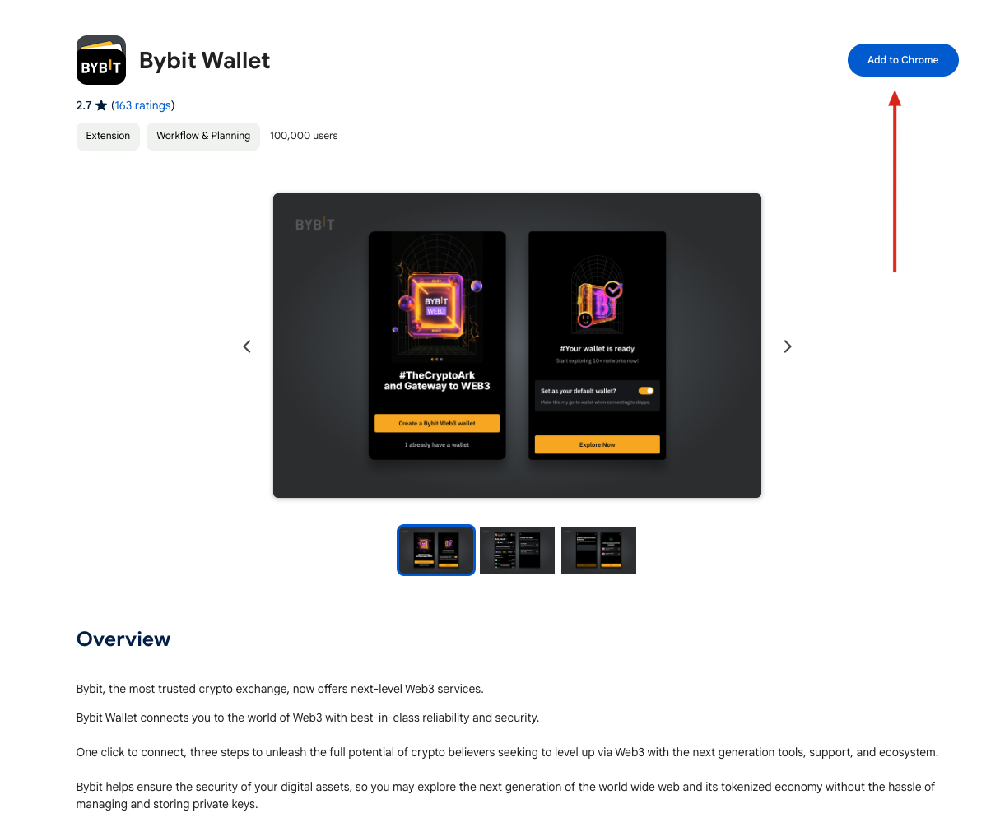

# 起步

## 安装

使用Google Chrome打开 [Chrome Web Store](https://chromewebstore.google.com/detail/bybit-wallet-extension/pdliaogehgdbhbnmkklieghmmjkpigpa) 然后点击“添加到Chrome“。

### 创建本地密码

安装完成后，点击Bybit Wallet图标，创建本地密码。本地密码仅用于加密本地存储的私钥和用户数据，以及锁定屏幕，不会被发送到服务器。用户一旦丢失本地密码，将无法恢复钱包，因此请务必牢记本地密码。

## 创建钱包/登录账户

目前Bybit Wallet仅支持托管钱包，即钱包的私钥由Bybit Wallet托管，用户无需自行保存私钥。

