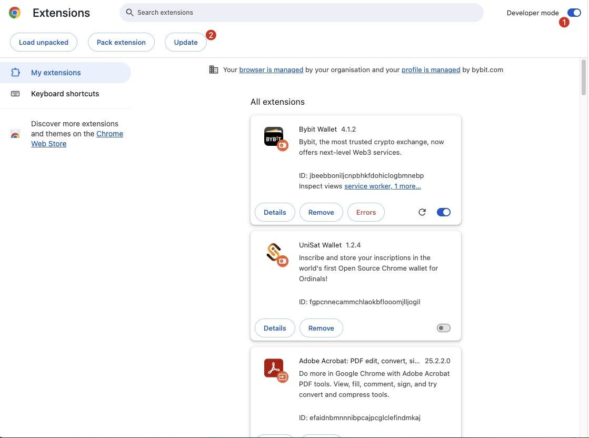

# 如何手动更新插件钱包?

Bybit Wallet钱包插件的更新是自动的，Chrome/Edge浏览器会定期检查已安装插件的更新。
具体来说，更新机制如下：

## 自动更新

Chrome 会在后台定期检查插件的更新，通常是每隔几小时。更新会自动下载并安装。

## 版本控制

每个插件都有一个版本号，开发者在发布新版本时会更新这个版本号。Chrome 会根据这个版本号来判断是否需要更新。

## 手动更新：

### 方法一：主动打开插件首页（推荐）

每一次打开Bybit Wallet插件首页，都会检查是否需要更新。

如果有可用的更新，会自动下载并安装。

当新版本完成安装后，会自动重启插件，此时插件的窗口会自动关闭，您已经打开的Dapp页面需要刷新才可以继续和钱包交互。
### 方法二：从Chrome插件管理页面更新
用户可以手动更新插件，方法如下：
- 打开 Chrome 浏览器，输入 `chrome://extensions/` 进入扩展程序页面。
- 在页面右上角，启用“开发者模式”。
- 点击“更新”按钮，Chrome 会立即检查所有已安装插件的更新并进行安装。

如果你需要手动更新某个特定的插件，可以按照上述步骤进行操作。
